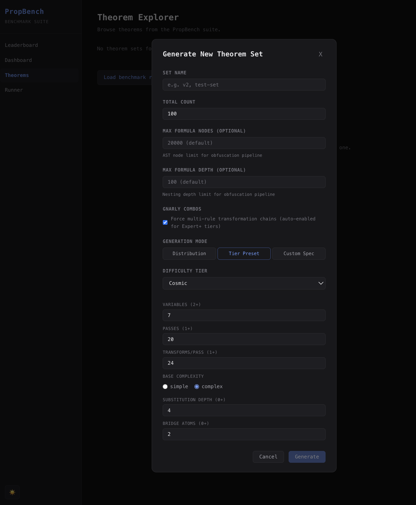
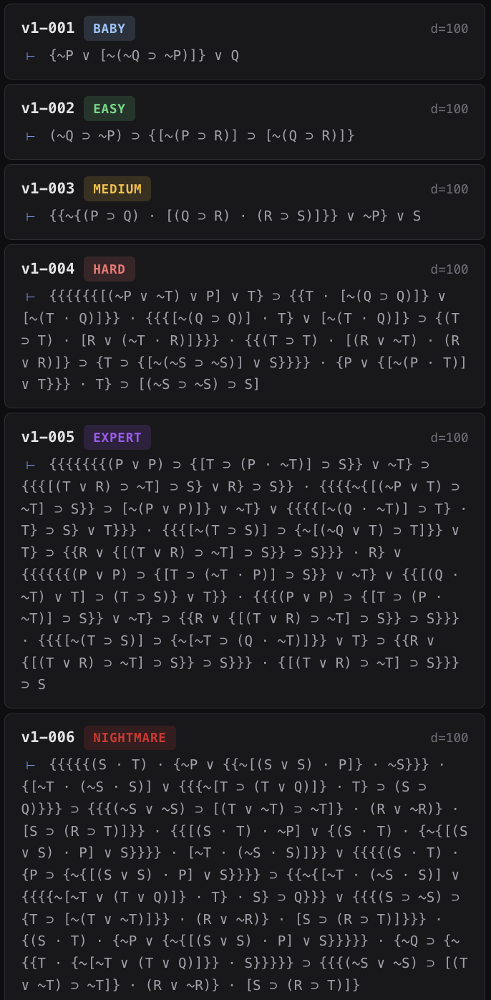

# PropBench

A saturation-proof reasoning benchmark that measures the ability of AI models to prove propositional logic theorems using Fitch-style natural deduction.

## Why PropBench?

This is the first reasoning benchmark that I am aware of which can be made arbitrarily difficult simply by tweaking a few variables. True, a benchmark simply testing multiplication of large numbers can be made arbitrarily difficult, but such a benchmark would become trivial with tool use. Automated theorem proving is an area of active research, and no set of tools currently exist that could turn this benchmark trivial, though I am sure agentic scaffolding would improve performance. 

## How It Works

1. **Generate theorems** — The Rust CLI produces tautologies at configurable difficulty tiers (Baby → Mind), controlling variables, transformation passes, substitution depth, and bridge atoms.
2. **Prompt LLMs** — The TypeScript harness sends each theorem to one or more models with the full set of 19 inference/equivalence rules, conditional proof, and indirect proof techniques.
3. **Parse & validate** — LLM output is parsed into structured proof lines, written to temp files, and validated by the Rust CLI (`propbench validate`).
4. **Score** — Valid proofs are scored by line count. Models are ranked using an Elo rating system with head-to-head matchups.

## Supported Models

- **Gemini** (direct API) — `gemini-2.5-pro`, `gemini-2.5-flash`, `gemini-3-flash-preview`, `gemini-3-pro-preview`, etc.
- **OpenRouter** (any model) — `anthropic/claude-sonnet-4.5`, `openai/gpt-4o`, `deepseek/deepseek-r1`, etc.

## Difficulty Tiers

| Tier | Variables | Passes | Transforms/Pass |
|------|-----------|--------|-----------------|
| Baby | 2 | 1 | 2 |
| Easy | 3 | 1 | 5 |
| Medium | 4 | 1 | 10 |
| Hard | 5 | 1 | 15 |
| Expert | 5 | 2 | 15 |
| Nightmare | 5 | 3 | 15 |
| Marathon | 6 | 5 | 20 |
| Absurd | 7 | 10 | 20 |
| Cosmic | 7 | 20 | 24 |
| Mind | 7 | 50 | 50 |

## Setup

### Prerequisites

- **Rust** — [rustup.rs](https://rustup.rs) (stable toolchain)
- **Node.js 20+** and **npm**
- At least one API key: `GEMINI_API_KEY` (Gemini direct) and/or `OPENROUTER_API_KEY` (all other models)

### 1. Build the Rust binary

```bash
cargo build --release
```

This produces `target/release/propbench`, which both the CLI harness and the GUI server depend on.

### 2. Install Node dependencies

```bash
# Root (harness + shared tooling)
npm install

# GUI (React + Express dev server)
cd gui && npm install && cd ..
```

### 3. Configure API keys

```bash
cp .env.example .env
```

Edit `.env` and fill in your keys:

```
GEMINI_API_KEY=...
OPENROUTER_API_KEY=...
```

### 4. Run the GUI

```bash
cd gui && npm run dev
```

Opens a web UI at `localhost:3000` with:

- **Dashboard** — Elo rankings, difficulty breakdown, head-to-head matrix, latency comparison, failure analysis
- **Benchmark Runner** — Configure models, theorem sets, token budgets, parallelism, cost limits; watch live progress via SSE
- **Theorem Explorer** — Browse theorems by difficulty, view side-by-side proof comparisons across models

## Project Structure

```
prop-bench/
├── src/main.rs          # Rust CLI: generate theorems & validate proofs
├── harness.ts           # Main orchestrator: LLM calls → parse → validate → score
├── parser.ts            # LLM output → structured proof lines
├── prompt.ts            # Prompt builder (rules, techniques, format spec)
├── scorer.ts            # Elo rating system
├── config.ts            # Shared types & difficulty tiers
├── db.ts                # SQLite storage layer (results saved to propbench.db)
├── models/              # LLM adapters (Gemini direct, OpenRouter)
├── gui/                 # React + Express web interface
└── benchmarks/          # User-generated theorem sets
```
## Theorem Generation Algorithm Simplified

(1) Pick a base argument form using one of the inference forms (1-8 in rules.md).

Looks like: 
p ⊃ q
p  /∴  q

(2) Wrap it as a tautology.

Looks like:
[(p ⊃ q) . p] ⊃ q

(3) Substitute atoms with compound formulas (if substitution_depth > 0).      
                                                                                
Replace each simple atom with a formula built from fresh atoms:               
  p  →  (R . T)                                                                 
  q  →  (S ∨ ~T) 

Now it looks like:
{[(R . T) ⊃ (S ∨ ~T)] · (R . T)} ⊃ (S ∨ ~T)

(4) Apply equivalence rules (9-18 in rules.md) at random positions, in random directions, repeatedly. 
 Equivalence rules are selected randomly with weighted probability. Distribution is down-weighted (0.2) to keep theorem size more predictable. Tautology expansion is blocked entirely because it bloats formula size without adding much in terms of difficulty. 

For example, apply Implication (rule 15) to the inner ⊃:
(R . T) ⊃ (S ∨ ~T)  →  ~(R . T) ∨ (S ∨ ~T)
Then DeMorgan (rule 10) on ~(R . T):
  ~(R . T)  →  (~R ∨ ~T)

Then Commutation (rule 11), Association (rule 12), more Implication,
Contraposition... dozens of times across multiple passes.

The formula becomes unrecognizable, but it's still the same tautology—every equivalence rule preserves truth by definition!

(5) Output: A single formula the LLM must prove is a tautology, using the same 18 rules + CP/IP that were used to obfuscate it.

See *generation_algorithm.md* for more details.

## Hierarchy of brackets
1. (P v Q)
2. [(P v Q) . R]
3. {[(P v Q) . R] ⊃ S}
4. {{[(P v Q) . R] ⊃ S} . T} ⊃ Y 
  
  And so on. Curly brackets are stacked on top of each other after we run out of parentheses and square brackets. This is done to make it harder for the LLM to parse the formula.

### Screenshots

Theorem Generation Screen:




Example Theorems:


